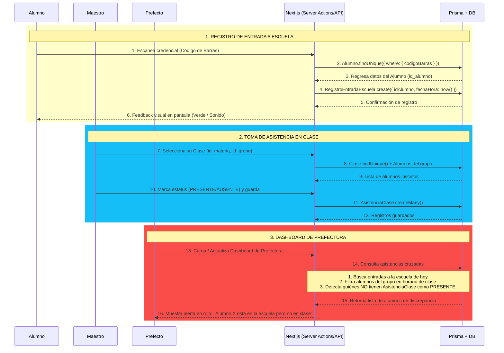

This is a [Next.js](https://nextjs.org) project bootstrapped with [`create-next-app`](https://nextjs.org/docs/app/api-reference/cli/create-next-app).

## Getting Started

First, run the development server:

```bash
npm run dev
# or
yarn dev
# or
pnpm dev
# or
bun dev
```

Open [http://localhost:3000](http://localhost:3000) with your browser to see the result.

You can start editing the page by modifying `app/page.tsx`. The page auto-updates as you edit the file.

This project uses [`next/font`](https://nextjs.org/docs/app/building-your-application/optimizing/fonts) to automatically optimize and load [Geist](https://vercel.com/font), a new font family for Vercel.

## ZeroPintas
El sistema debe mostrar al perfecto en tiempo real el estado de un alumno, el sistema debe manejar estados dinamicos. 
Un alumno podra tener 3 estados principales Ausente En Plantel/Sin Clase En clase

## Flujo del Sistema - Diagrama de Secuencia

El sistema conecta 3 actores con el backend en Next.js (Server Actions/API) y Prisma + DB.

### Actores
- **Alumno:** Solo escanea su credencial.
- **Maestro:** Gestiona la asistencia de su clase.
- **Prefecto:** Monitorea discrepancias.
- **Next.js:** Orquestador / API.
- **Prisma + DB:** Persistencia.

### Flujos

#### 1. Registro de Entrada a Escuela (Amarillo - Pasos 1-6)

El alumno escanea su código de barras -> Next.js hace `Alumno.findUnique({ where: { codigoBarras } })` -> Si existe, crea `RegistroEntradaEscuela.create({ idAlumno, fechaHora: now() })` -> Devuelve feedback visual en pantalla (Verde / Sonido)

#### 2. Toma de Asistencia en Clase (Azul - Pasos 7-12)
El maestro selecciona su clase `(id_materia, id_grupo)` -> El backend consulta `Clase.findUnique() + Alumnos del grupo` y retorna la lista de inscritos. El maestro marca `PRESENTE/AUSENTE` y guarda -> Se ejecuta `AsistenciaClase.createMany()` -> Confirmación de guardado

#### 3. Dashboard de Prefectura - Detección de Fugas (Rosa - Pasos 13-16)
Es la lógica clave del sistema. El prefecto carga el Dashboard:
1.  Next.js consulta asistencias cruzadas.
2.  **Lógica de negocio:** 
    - Busca entradas a la escuela de hoy.
    - Filtra alumnos del grupo en horario de clase.
    - Detecta quiénes NO tienen `AsistenciaClase` registrada como PRESENTE.
3.  Retorna lista de alumnos en discrepancia y muestra alerta en rojo: **"Alumno X está en la escuela pero no en clase"**
